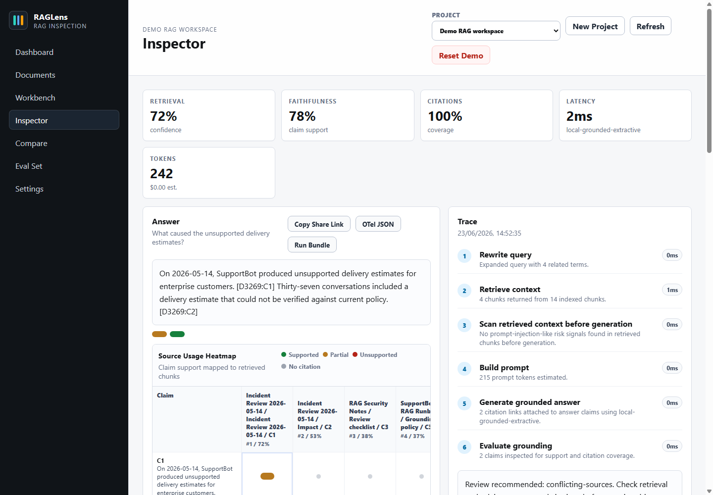
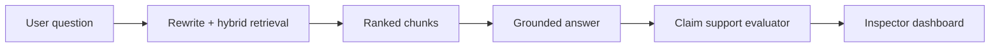

# RAGLens

RAGLens is a local inspection dashboard for retrieval-augmented generation (RAG) apps. The goal is to make it obvious whether a bad answer came from weak retrieval, stale context, duplicate chunks, missing citations, or unsupported generation.

The app runs without API keys, databases, or external services. The repo includes a demo corpus and a deterministic local pipeline, so a fresh clone can inspect a RAG run right away.



## Relationship To TraceLens

TraceLens is the main project in the stack. It is the enterprise monitoring and governance layer for trace artifacts, policy gates, eval diffs, review workflows, SLO reports, model-serving overlays, and redacted incident review.

RAGLens is the companion RAG workbench. It is where you upload documents, tune chunking and retrieval, run questions, inspect citations, compare local runs, and produce concrete artifacts from a working RAG pipeline. It is deliberately smaller than TraceLens.

Use RAGLens when you want to build and inspect a RAG run. Use TraceLens when you want to operate, govern, and explain many RAG or agent runs across teams, releases, models, and private open-weight deployments.

The handoff is covered by a checked contract:

- `GET /api/query-runs/:id/otel` exports rich OTLP with query rewrites, retrieval documents, prompt context ids, answer claims, citations, evaluation metrics, token usage, privacy posture, and model identity.
- `GET /api/query-runs/:id/bundle` exports a portable local run bundle for reviewer handoff and future richer adapters.
- An external claim verifier can sit between them when you want stronger claim decomposition before TraceLens routes failures.

With both repositories cloned side by side, `npm run stack:demo` runs a real baseline and stale-source candidate through RAGLens, imports them into TraceLens, produces a release decision, and verifies a redacted review bundle.

See `docs/tracelens-positioning.md` for the boundary in more detail.

## What It Does

- Document indexing for TXT, Markdown, CSV, JSON, logs, and best-effort PDF text, including common Flate-compressed text streams.
- Project-scoped workspaces so documents, runs, and eval checks stay separated.
- Optional queued document ingestion with visible job state for larger uploads.
- Local hash embeddings plus keyword/vector/hybrid retrieval with matched terms, missing terms, score, coverage, similarity, rerank score, and novelty.
- Grounded extractive answer generation with citations back to retrieved chunks, plus optional OpenAI-compatible chat generation.
- Claim-level support labels and a source usage heatmap that maps each claim to retrieved chunks.
- Metrics for retrieval confidence, context relevance, faithfulness, citation coverage, redundancy, and answer focus.
- Configurable latency, token, and provider cost accounting for each run.
- Eval metrics for precision@k, recall@k, and MRR when an eval question has an expected source.
- Run history, trace timeline, eval-set runner, and side-by-side run comparison with metric, config, answer, retrieval-overlap, and warning deltas.
- Editable eval checks with expected source documents for regression testing.
- Settings for provider/model, temperature, chunking, retrieval mode, prompt template, prompt logging, redaction, and reranking.
- Feedback capture, share links, portable run bundle export, OTLP/HTTP trace export, Docker Compose, and PR eval workflow.
- Prompt-injection-like document scan for retrieved chunks before generation.
- Zero runtime dependencies.

## Quick Start

```bash
npm start
```

Open `http://127.0.0.1:4177`.

The demo workspace is seeded automatically on first run. To reseed it:

```bash
npm run seed
```

## Scripts

```bash
npm start       # run the local web app
npm run dev     # same runtime, useful for development
npm run build   # syntax check all JS files
npm run lint    # run static security and workflow hygiene checks
npm test        # run unit and pipeline tests
npm run integration:check # exercise the core HTTP/API flow
npm run service:check # start the production entrypoint and check health/query/share
npm run eval    # run seeded RAG evals
npm run corpus:fetch # download external SQuAD, StratRAG, and SciFact slices into corpora/
npm run corpus:eval # run external corpus slices and update docs/corpus-evaluation.md
npm run corpus:app-demo # drive the app API with external corpus docs/evals/runs
npm run stack:demo # run the RAGLens-to-TraceLens corpus and release workflow
npm run docker:check # validate Dockerfile, Compose, and dockerignore contract
npm run api:contract # validate docs/api/openapi.json against the router contract
npm run postgres:contract # validate hosted Postgres/pgvector schema contract
npm run postgres:export -- --demo # emit SQL seed data for the hosted schema
npm run release:audit # check release docs, workflows, security, and reviewer contracts
npm run doctor # summarize local publish readiness and missing external tools
npm run preflight # run all local release checks
npm run seed    # reset the demo corpus
```

## Why This Exists

Final answers hide too much. RAGLens breaks a run into inspectable stages:



The inspector shows the exact chunks used, why they matched, how much query coverage they had, whether the answer claims were supported, which sources were cited for each claim, and which warnings need review.

The Compare screen is for regression work: select a baseline and candidate run to see what changed in provider/model settings, prompt template fingerprint/preview, chunking snapshot, top-k, retrieval mode, answer claims, retrieved chunks, and warning types.

Each inspected run can also be exported as a portable JSON bundle containing the hydrated run, retrieved evidence, source document metadata, metrics, warnings, and review summary. Browser state and bundles omit raw embedding vectors and term-count internals.

## Project Structure

```text
public/          Browser dashboard
src/http/        Dependency-free HTTP server and API routes
src/rag/         Chunking, retrieval, answer generation, evaluation
src/services/    JSON store and run hydration
scripts/         Build and demo helpers
test/            Node test suite
docs/            Architecture and evaluation notes
```

## Release Workflow

Run these before pushing a release branch or tag:

```bash
npm run doctor
npm run preflight
```

See `docs/implementation-matrix.md` for implementation coverage and `docs/release-checklist.md` for the browser and repository review.

## Corpus Evaluation

The built-in demo proves the app flow. For a stronger retrieval check, use the external corpus harness:

```bash
npm run corpus:fetch
npm run corpus:eval -- --report=docs/corpus-evaluation.md
npm run corpus:app-demo -- --report=docs/app-corpus-demo.md
```

The downloader prepares small slices from SQuAD, StratRAG, and SciFact under `corpora/`. That directory is ignored by git and Docker. `corpus:eval` runs the benchmark-style pipeline check; `corpus:app-demo` drives the HTTP API used by the browser app: settings, document ingestion, eval question creation, query runs, state hydration, and bundle export. The latest checked reports are `docs/corpus-evaluation.md` and `docs/app-corpus-demo.md`.

For the cross-project release demonstration:

```bash
npm run stack:demo
```

The generated report and artifacts are written under `corpora/results/tracelens-stack-demo`. See `docs/tracelens-stack-demo.md` for the scenario and expected decision.

## API Surface

The machine-readable API contract lives at `docs/api/openapi.json`. Validate it with `npm run api:contract`.
Project-scoped read and mutation endpoints accept an optional `projectId` in the request body or query string. Settings are project-scoped too, so chunking, prompt, model, and retrieval defaults follow the targeted project. When omitted, RAGLens falls back to the active project for local single-browser workflows.

- `GET /api/state`
- `POST /api/projects`
- `PATCH /api/projects/active`
- `PATCH /api/settings`
- `POST /api/documents`
- `POST /api/documents/reindex`
- `GET /api/ingestion-jobs`
- `POST /api/ingestion-jobs`
- `GET /api/ingestion-jobs/:id`
- `DELETE /api/documents/:id`
- `POST /api/query-runs`
- `GET /api/query-runs/:id`
- `POST /api/query-runs/:id/feedback`
- `GET /api/query-runs/:id/otel`
- `GET /api/query-runs/:id/bundle`
- `GET /api/share/:id`
- `GET /api/compare?left=:id&right=:id`
- `POST /api/eval-questions`
- `DELETE /api/eval-questions/:id`
- `POST /api/demo/reset`

## Configuration

Copy `.env.example` to `.env` or set environment variables directly:

```bash
RAGLENS_HOST=127.0.0.1
RAGLENS_ALLOWED_HOSTS=
RAGLENS_PORT=4177
RAGLENS_DATA_DIR=./data
RAGLENS_AUTO_SEED=true
RAGLENS_STORAGE_DRIVER=json
RAGLENS_DATABASE_URL=
RAGLENS_DATABASE_POOL_MAX=5
RAGLENS_DATABASE_SSL=false
RAGLENS_ALLOW_INSECURE_DATABASE_SSL=false
RAGLENS_ADMIN_TOKEN=
RAGLENS_ALLOW_UNSAFE_PUBLIC_BIND=false
RAGLENS_ALLOW_UNSAFE_PROVIDER_HTTP=false
RAGLENS_ALLOW_UNSAFE_OTEL_HTTP=false
RAGLENS_OPENAI_API_KEY=
RAGLENS_OPENAI_BASE_URL=https://api.openai.com/v1
RAGLENS_OPENAI_MODEL=gpt-4.1-mini
RAGLENS_OPENAI_TIMEOUT_MS=30000
RAGLENS_COST_INPUT_USD_PER_1M=0
RAGLENS_COST_OUTPUT_USD_PER_1M=0
RAGLENS_OTEL_EXPORT_URL=
RAGLENS_OTEL_SERVICE_NAME=raglens
RAGLENS_OTEL_TIMEOUT_MS=5000
RAGLENS_OTEL_HEADERS=
RAGLENS_OTEL_INCLUDE_CONTENT=false
RAGLENS_PDF_TEXT_COMMAND=
RAGLENS_PDF_TEXT_ARGS=["-layout","{input}","-"]
RAGLENS_PDF_TEXT_TIMEOUT_MS=10000
```

A few config notes:

- RAGLens refuses non-loopback binds without a 32+ character `RAGLENS_ADMIN_TOKEN` unless `RAGLENS_ALLOW_UNSAFE_PUBLIC_BIND=true` is explicitly set.
- Requests must use an allowed `Host` header. By default that means `localhost`, `127.0.0.1`, `::1`, plus the configured bind host when it is not a wildcard. Use `RAGLENS_ALLOWED_HOSTS` for a trusted reverse proxy or custom hostname.
- Leave `RAGLENS_OPENAI_API_KEY` empty for deterministic local generation, or for a local unauthenticated OpenAI-compatible server such as vLLM. Set it for keyed providers and choose `openai-compatible` in Settings to call `/chat/completions`.
- Provider base URLs must use HTTPS unless they point at loopback or Docker host aliases. Use `RAGLENS_ALLOW_UNSAFE_PROVIDER_HTTP=true` only for trusted local test networks.
- Retrieved chunks with prompt-injection-like or sensitive-data-like text stay local by default. A run must explicitly set `allowUnsafeProviderEgress=true` before that context is sent to a live provider.
- Set `RAGLENS_COST_*` to your provider's current per-1M-token prices when you want nonzero cost estimates.
- Set `RAGLENS_OTEL_EXPORT_URL` to an HTTPS OTLP/HTTP traces endpoint to export run traces after each query. HTTP is accepted only for loopback unless `RAGLENS_ALLOW_UNSAFE_OTEL_HTTP=true`; credentials, query strings, and fragments are rejected. `RAGLENS_OTEL_HEADERS` accepts a JSON object for collector auth headers and is never exposed through `/api/state`. Raw questions are not exported unless `RAGLENS_OTEL_INCLUDE_CONTENT=true`.
- Set `RAGLENS_PDF_TEXT_COMMAND` to an absolute path for a trusted `pdftotext`-compatible binary. RAGLens runs it without a shell using `RAGLENS_PDF_TEXT_ARGS`, where `{input}` is replaced with a temporary PDF path, and falls back to the internal parser on failure.
- Set `RAGLENS_STORAGE_DRIVER=postgres` and `RAGLENS_DATABASE_URL` for hosted Postgres persistence after applying `docs/database/postgres-pgvector.sql`. `RAGLENS_DATABASE_SSL=true` verifies server certificates by default; `RAGLENS_ALLOW_INSECURE_DATABASE_SSL=true` is only for trusted local test networks. The local default remains `json` and has no runtime dependencies; the Postgres deployment image must install the optional `pg` package.

For local vLLM generation, point `RAGLENS_OPENAI_BASE_URL` at the vLLM `/v1` endpoint and choose `openai-compatible` in Settings. See `docs/vllm.md` for host and Docker Compose examples.

## Docker

```bash
# .env
RAGLENS_ADMIN_TOKEN=replace-with-a-long-random-token

docker compose up --build
```

Compose publishes RAGLens on `127.0.0.1:4177` by default, allows loopback hostnames, and refuses to start until `RAGLENS_ADMIN_TOKEN` is provided.
When an admin token is configured, JSON API routes other than `/api/health` require the token. The browser prompts for it and stores it in `sessionStorage` for the current browser session.

Compose runs the app as a non-root user with a read-only root filesystem, dropped Linux capabilities, `no-new-privileges`, process/memory limits, and tmpfs for parser temp files.
Compose also maps `host.docker.internal` to the host gateway so the app container can reach a local vLLM server at `http://host.docker.internal:8000/v1`.

The Docker runtime check is `npm run docker:runtime`. It builds the image, starts a secured container, checks `/api/health`, confirms unauthenticated API requests are rejected, creates a run, and exports a run bundle.

## Roadmap

- Better PDF layout extraction beyond the current internal parser plus optional `pdftotext`-style command.
- Multi-user hosted auth and row-level access controls. The current Postgres runtime adapter is project-scoped for one trusted deployment instance; the checked schema contract lives at `docs/database/postgres-pgvector.sql` and is validated by `npm run postgres:contract`.

To seed a hosted Postgres database from local data, apply `docs/database/postgres-pgvector.sql`, then run `npm run postgres:export -- --input ./data/raglens.json --out ./raglens-seed.sql` and apply the generated SQL. Use `--demo` instead of `--input` to export the built-in demo workspace. Runtime adapter code lives in `src/services/postgres-store.js`; parameterized SQL statements live in `src/services/postgres-statements.js`.

## License

MIT
